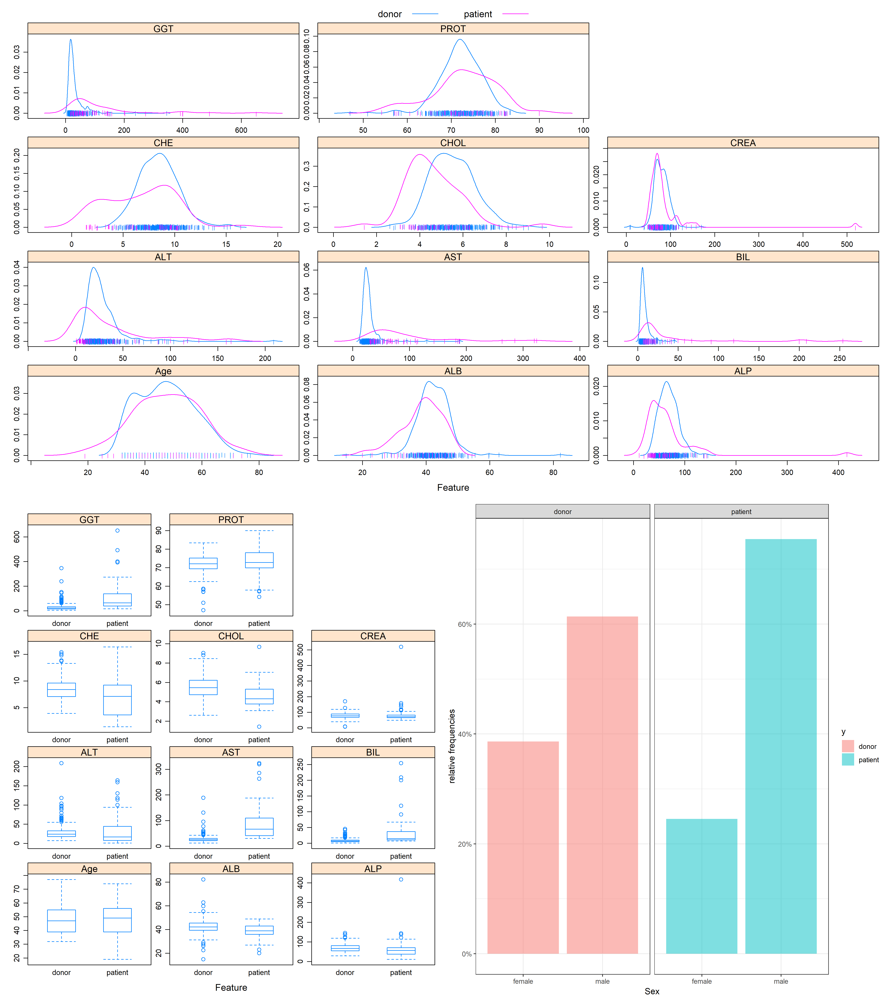
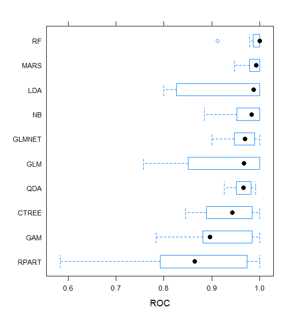
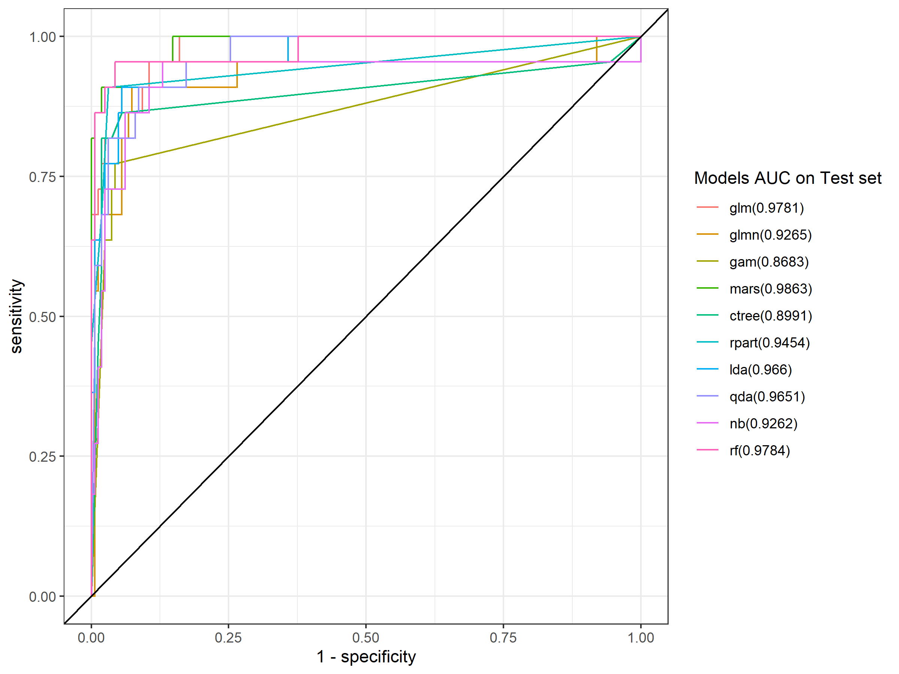
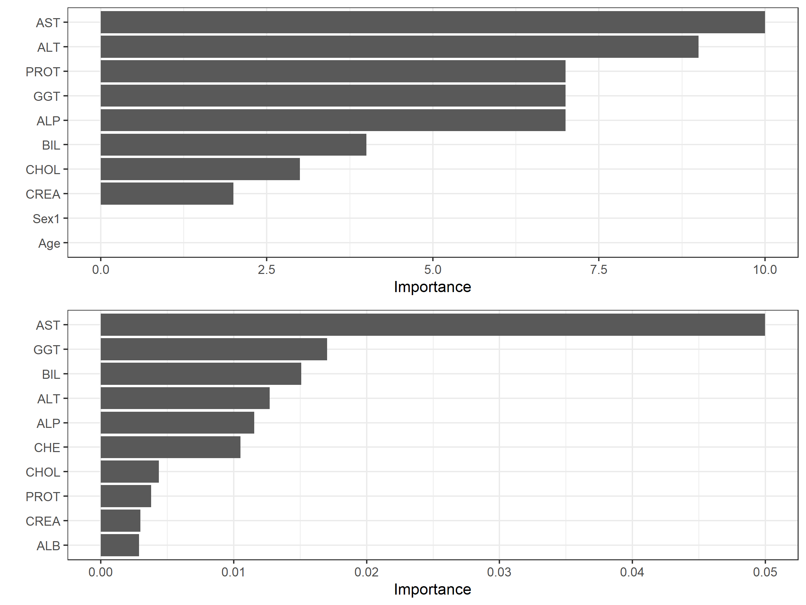

\newpage

```{r setup, include=FALSE}
knitr::opts_chunk$set(echo = TRUE, warning = FALSE, message = FALSE)
```

# 1 Introduction

## 1.1 Data Source

The original purpose of the research where the data set was built was to replace liver biopsy for disease staging. In the study, multiple serum markers in this dataset are under evaluation with multi-parametric panels yielding the most promising results\(^{1,2}\).

## 1.2 Motivation

According to the Centers for Disease Control and Prevention (CDC): Hepatitis C is a liver infection caused by the hepatitis C virus (HCV). Hepatitis C is spread through contact with blood from an infected person. Today, most people become infected with the hepatitis C virus by sharing needles or other equipment used to prepare and inject drugs. For some people, hepatitis C is a short-term illness, but for more than half of people who become infected with the hepatitis C virus, it becomes a long-term, chronic infection. Chronic hepatitis C can result in serious, even life-threatening health problems like cirrhosis and liver cancer. People with chronic hepatitis C can often have no symptoms and don’t feel sick. When symptoms appear, they often are a sign of advanced liver disease. There is no vaccine for hepatitis C. The best way to prevent hepatitis C is by avoiding behaviors that can spread the disease, especially injecting drugs. Getting tested for hepatitis C is important, because treatments can cure most people with hepatitis C in 8 to 12 weeks\(^{3}\).

Creating a predictive model that could perform early detection of Hepatitis C and other liver diseases would allow people to quickly and easily determine their risk/get treatment.

## 1.3 Data Preparation and Cleaning

The data contains 615 observations and 13 attributes of blood donors and Hepatitis C patients laboratory (10 laboratory results) and demographic values (age and gender), as well as a subject Category indicator. All attributes except the outcome indicator Category (blood donors vs. Hepatitis C, including its progress-Hepatitis C, Fibrosis, Cirrhosis) and Sex are numerical. Package `tydiverse` were used to clean data and transform data types for analysis convenience, package `caret` were used to partitioning data to training and testing set, 70% of the data to be train data and the 30% rest to be test data. I investigated for abnormal values in laboratory values, as well as the missing data. The are total 31 observations missing values in ALB, ALP, ALT, CHOL and PROT, which were assumed to be missing-at-random (MAR). Since there are only 615 observations so I implement bagging imputation method to impute the missing value using the training set, then apply it to the test set. Continuous variables were not transformed since most of them are approximately normal. The descriptive analysis is shown in Table 1.
```{r, echo=FALSE}
library(gtsummary)
library(tidyverse)
hcv <- read.csv("HepatitisCdata.csv")[,-1]
hcv %>%
  tbl_summary(by = Category, missing_text = "Missing/NA") %>%
  add_p(pvalue_fun = ~style_pvalue(.x, digits = 2)) %>%
  add_overall() %>%
  add_n() %>%
  modify_header(label ~ "**Variable**") %>%
  modify_spanning_header(c("stat_1", "stat_2") ~ "**Subject Type**") %>%
  modify_footnote(
    all_stat_cols() ~ "Median (IQR) or Frequency (%)"
  ) %>%
  modify_caption("**Summary of Dataset**") %>%
  bold_labels() 
```


# 2 Exploratory analysis/visualization

In this section, I used the function `featurePlot()` in `caret` to visualize the continuous variables and the only binary predictor Sex in the training set. The Sex is plotted as a continuous variable for simplicity.



The feature plots (see Figure 1) shows that the continuous predictors are almost normal after Box-Cox transformation. And it seems that there are difference in distributions in CHE and CHOL. As for GGT, AST, BIL, CHE, PROT and ALT, the patients seem to have a wider distribution than the donors', which means that there might be more variability among patients. The rest of the continuous variable do not show an clearly difference. The percentage bar plot of Sex show that the percentage of male are higher in patient group.

# 3 Modeling

## 3.1 Predictors

In the modeling part, all variables were included and there wasn't variable selection procedure prior to modeling process. The target response variable is Category, which was recoded as 0 and 1, representing healthy blood donors and kinds of liver diseases patients.

Specifically, here shows the predictors in the models:
(1) Age: age of the patient in years;
(2) Sex: sex of the patient;
(3) ALB: amount of albumin in patient's blood;
(4) ALP: amount of alkaline phosphatase in patient's blood;
(5) ALT: amount of alanine transaminase in patient's blood;
(6) AST: amount of aspartate aminotransferase in patient's blood;
(7) BIL: amount of bilirubin in patient's blood;
(8) CHE: amount of cholinesterase in patient's blood;
(9) CHOL: amount of cholesterol in patient's blood;
(10) CREA: amount of creatine in patient's blood;
(11) GGT: amount of gamma-glutamyl transferase in patient's blood;
(12) PROT: amount of protein in patient's blood;

## 3.2 Used Techniques

This application focuses on classification methods. Specifically, techniques used include generalized linear regression (with/without penalization, GLM and GLMNET) , generalized addictive model (GAM), multivariate adaptive regression spline (MARS), linear/quadratic discriminant analysis (LDA/QDA), tree method (CTREE and RPART) and naive Bayes classifier (NB). Several of these methods, such as GLM, LDA, QDA and NB, are utilized because they have few distributional assumptions and are adaptable to our categorical predictors. GLM and its penalized version also make assumptions on independence on errors and dependent variable distribution. I also use random forests (RF) as a extensions of tree methods to increase predictive performance, that randomly select subsets of features to use in collections of decision trees and it depends on no assumptions on distributional and it is a non-parametric method. 

## 3.3 Tuning parameters

Most of the models have tuning parameters. The selection of tuning parameters follows a procedure: Initially, I used a wide range and coarse search pattern (this step isn't provided in the appendix code); Then, after locating approximate ranges for the selected parameters where show the best cross-validation performance, I then search parameter patterns within a narrower range and with more density by decreasing the step within each parameter sequence. For some specific method like MARS, the range of tuning parameters (degree of features and number of terms) are select considering model definition. The best tuning parameters given by the cross-validation is: (1)GLMNET: `alpha = 0.3`,`lambda = 0.424`; (2)MARS: `nprune = 11`, `degree = 1`; (3)CTREE: `mincriterion = 0.699`; (4)RPART: `cp = 0.020`; (5)NB: `usekernel = TRUE`, `adjust = 0.8`; (6)RF: `mtry = 2`, `splitrule = gini`, `min.node.size = 16`.

## 3.4 Training Performance

All models performance were evaluated by using 10-folds cross-validation on the training set. Repeated-CV is not used due to the computational cost. The cross-validation results are shown below (see Figure 2): 



All methods shows a good predictive performance with mean cross-validation AUC over 0.90. And the comparison shows that the RF shows the best performance with mean AUC=0.9878. The CV box plot also shows that the two simple tree method are not stable since there are more variability in CV results. It also surprising to find that flexible model such as GAM does not show a good performance, that may cause by the bias-variance trade-off.

## 3.5 Test performance

For model performance on test set, I mainly focus on the top 2 best performance models in the evaluation on the training set, MARS and RF, but the results of the rest are shown as well. 



From the ROC plot (see Figure 3), considering the models chosen for evaluating performance, MARS model outperforms the RF model with a test AUC=0.9863. 


## 3.6 Variable Importance

Variable importance is computed by permutation, implemented during model training.  Focusing on the models with the top 2 performance on the training set, the important variables are shown in the following plot (see Figure 4).



The MARS model shows that the relative variable importance follows this order: AST, ALT, PROT, GGT, ALP, BIL, CHOL and CREA, while RF gives another order: AST, GGT, BIL, ALT, ALP, CHE, CHOL, PROT, CREA, ALB. Although there are difference in orders, both models gives AST the highest importance. 

## 3.7 Limitations

The final models (MARS and RF) are very limited in their interpretability; while their flexibility
is particularly useful for underlying complex truths, using these methods means we are sacrificing clinical interpretability. GLM did perform well in test set and it is easy to interpret, however, due to the lower performance in CV, I didn't choose it as the final model.

Imputation methods are used to deal with missing data, however, we would never know whether the data are missing at random or not in real situation.

Noticing that the dataset is substantially unbalanced (540 healthy/suspective blood donors vs. 75 liver disease patients), in this study, no oversampling method were implemented to deal with this problem, which may affect model performance. Also, for simplicity, this study only considered two response category, future works should be done in multiclass classification tasks.

# 4 Conclusion

Base on previous discussions, in this study, models using patient's laboratory results and demographic values as predictors are successful at classifying Hepatitis C virus patients and healthy blood donors. The final models, which are the MARS and RF, have AUC over 0.9784 on test data. This suggests using a good dataset plus proper modeling may be helpful in clinical decision support, or even have proactive utility.

The amount of aspartate aminotransferase (AST) in a patient's blood contributes significantly in prediction than any other feature, which means that AST may have close relation to liver diseases. 

# 5 Bibliography

1. Hoffmann, G., Bietenbeck, A., Lichtinghagen, R., & Klawonn, F. (2018). Using machine learning techniques to generate laboratory diagnostic pathways—a case study. Journal Of Laboratory And Precision Medicine, 3(6).

2. Lichtinghagen, R., Pietsch, D., Bantel, H., Manns, M. P., Brand, K., & Bahr, M. J. (2013). The Enhanced Liver Fibrosis (ELF) score: normal values, influence factors and proposed cut-off values. Journal of hepatology, 59(2), 236–242. https://doi.org/10.1016/j.jhep.2013.03.016

3. https://www.cdc.gov/hepatitis/hcv/index.htm#:~:text=Hepatitis%20C%20is%20a%20liver,to%20prepare%20and%20inject%20drugs.

# 6 Appendix

The code used in this study are in the appendix file. Including data processing methods, modeling methods, tuning parameters selection, model comparison, etc. See [Appendix](file: p8106-midterm-rw2844.rmd)